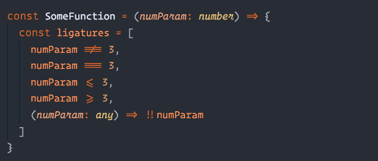

# Microsoft VS Code IDE Settings
To setup the bestest, most hipster, optimized for viewing pleasure developement environment you can have as a developer.

I recommend trying out Fira Code ligatures if you're a JS developer to get your code to look like this:

# Pre-requisite Requirements
(v1.10.2) Visual Code
(included) Operator Mono Font
(optional recommended) [Fira Code](https://github.com/tonsky/FiraCode)
(optional) [Firewatch Theme](https://marketplace.visualstudio.com/items?itemName=ulthes.theme-firewatch)
(optional) [Arc Theme](https://marketplace.visualstudio.com/items?itemName=SolarLiner.arc-theme)

# Base installation
run `setup.sh`

# VSCode Extensions
Vim
Custom CSS and JS Loader
vscode-elixir
vscode-styled-components
GraphQL for VSCode
Material Icon Theme
Linux Themes for VS Code
